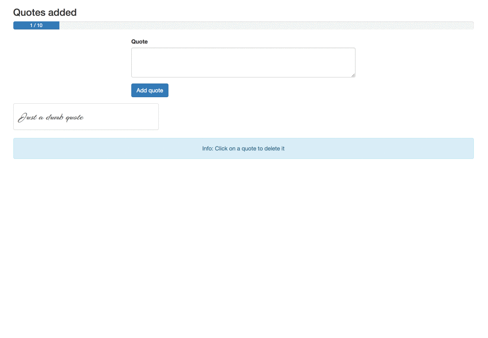

# Quotes Manager
## Introduction

A demo project based upon simple basic vuejs concepts.

Available features:
 * Edit a quote
 * Display quotes in a grid
 * Delete a quote
 * Display the quotes count in a progress bar



## Build Setup

``` bash
# install dependencies
npm install

# serve with hot reload at localhost:8080
npm run dev

# build for production with minification
npm run build
```

For detailed explanation on how things work, consult the [docs for vue-loader](http://vuejs.github.io/vue-loader).
